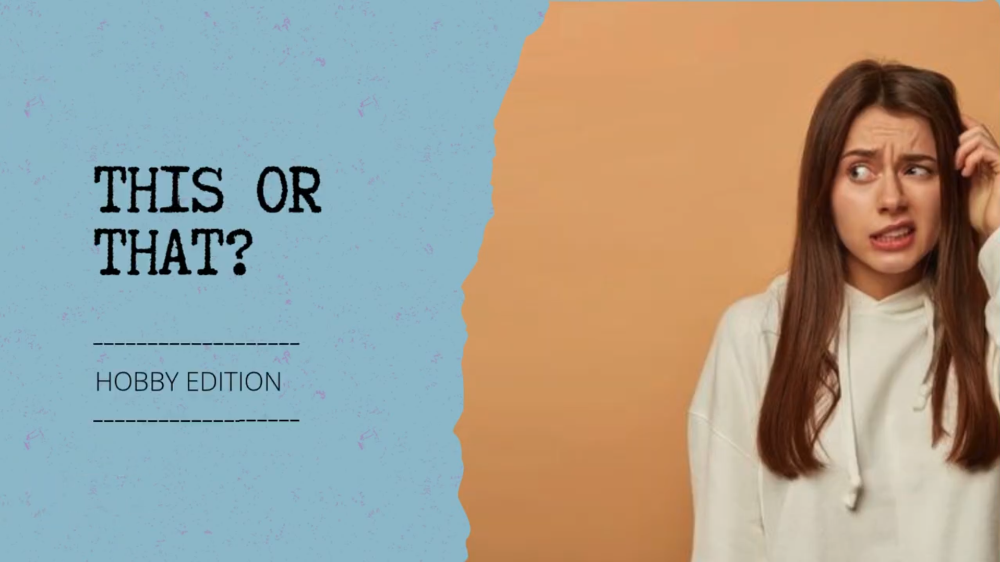
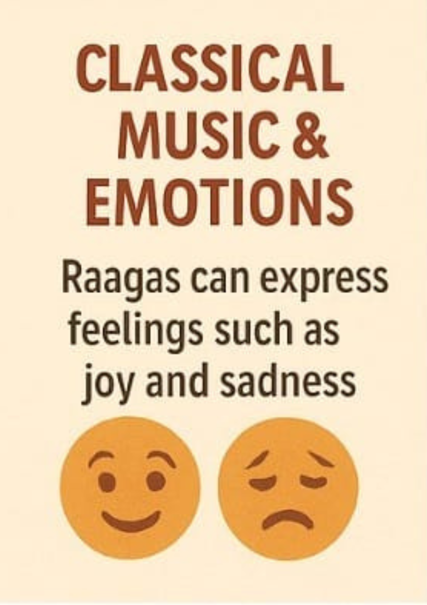

# Learn Sparkle Quest

[](https://learn-sparkle-quest-main-n1vw6yzi0.vercel.app)

## 🌟 Live Website

👉 [https://learn-sparkle-quest-main-n1vw6yzi0.vercel.app](https://learn-sparkle-quest-main-n1vw6yzi0.vercel.app)

---

## 📚 Table of Contents
- [Project Overview](#-project-overview)
- [Features](#-features)
- [Screenshots](#-screenshots)
- [Tech Stack](#-tech-stack)
- [Getting Started](#-getting-started)
- [Build for Production](#-build-for-production)
- [Contribution](#-contribution)
- [FAQ](#-faq)
- [Contact](#-contact)
- [License](#-license)

---

## ✨ Project Overview

**Learn Sparkle Quest** is a fun, interactive, and gamified learning platform for kids and young learners. It features:
- Flash card learning
- Visual and audio learning modes
- Quizzes and progress tracking
- Beautiful, responsive UI
- Chapter-based navigation

---

## 🚀 Features

- **Multiple Learning Modes:**
  - Flash Cards: Quick memorization with images and facts
  - Visual Learning: Video-based, interactive content
  - Audio Learning: Listen and learn with stories, vocabulary, and more
- **Interactive Quizzes:**
  - True/False and Multiple Choice questions after each section
  - Final quizzes for each chapter
- **Progress Tracking:**
  - See your progress for each mode and chapter
  - Earn badges for completed chapters
- **Responsive Design:**
  - Mobile-first, works great on all devices
- **Modern UI:**
  - Gradient backgrounds, animated buttons, and beautiful cards
- **Easy Navigation:**
  - Tab-based chapter selection, reset progress, and more

---

## 🖼️ Screenshots

> _Add your own screenshots here!_

| Dashboard | Learning Mode | Quiz |
|-----------|--------------|------|
|  |  |  |

---

## 🛠️ Tech Stack

- [React](https://react.dev/) + [TypeScript](https://www.typescriptlang.org/)
- [Vite](https://vitejs.dev/) (blazing fast dev/build)
- [Tailwind CSS](https://tailwindcss.com/) for styling
- [shadcn/ui](https://ui.shadcn.com/) for beautiful components
- [Vercel](https://vercel.com/) for hosting

---

## 🧑‍💻 Getting Started

1. **Clone the repository:**
   ```bash
   git clone https://github.com/AdityaAdi07/Learn-Sparkle-Pitchfest.git
   cd learn-sparkle-quest-main
   ```
2. **Install dependencies:**
   ```bash
   npm install
   ```
3. **Start the development server:**
   ```bash
   npm run dev
   ```
4. **Open in your browser:**
   Visit [http://localhost:5173](http://localhost:5173)

---

## 📦 Build for Production

```bash
npm run build
```

---

## 🤝 Contribution

Contributions are welcome! To contribute:
1. Fork the repository
2. Create a new branch (`git checkout -b feature/your-feature`)
3. Commit your changes (`git commit -m 'Add new feature'`)
4. Push to the branch (`git push origin feature/your-feature`)
5. Open a Pull Request

---

## ❓ FAQ

**Q: Who is this app for?**
> Kids, students, and anyone who loves interactive learning!

**Q: Can I use this on my phone?**
> Yes! The app is fully responsive and mobile-friendly.

**Q: How do I reset my progress?**
> Use the reset button on the dashboard to clear your progress for testing or starting over.

**Q: How do I add new chapters or content?**
> Edit the `src/data/mockData.ts` file to add or modify chapters, sections, and questions.

---

## 📬 Contact

For questions, suggestions, or feedback:
- GitHub Issues: [Open an issue](https://github.com/AdityaAdi07/Learn-Sparkle-Pitchfest/issues)
- Email: [adityaadi07@gmail.com](mailto:sushmaaditya717@gmail.com)

---

## 📄 License

MIT
